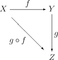

# 计算机编程中的数学

### 群group

在数学中，群（group）是由一个集合以及一个二元运算所组成的，符合下述四个性质（称为“群公理”）的代数结构。这四个性质是封闭性、结合律、单位元和对于集合中所有元素存在逆元素。很多熟知的数学结构比如数系统都遵从群公理，例如整数配备上加法运算就形成一个群。如果将群公理的公式从具体的群和其运算中抽象出来，就使得人们可以用灵活的方式来处理起源于抽象代数或其他许多数学分支的实体，而同时保留对象的本质结构性质。

群在数学内外各个领域中是无处不在的，这使得它们成为当代数学的组成的中心原理。

群与对称性有密切的联系。例如，对称群描述了几何体的对称性：它是保持物体不变的变换的集合。李群应用于粒子物理的标准模型之中；庞加莱群也是李群，能表达狭义相对论中的对称性；点群能帮助理解分子化学中的对称现象。

#### 定义

群(G,·)是由集合G和二元运算"·"构成的，符合以下四个性质（称“群公理”）的数学结构。其中，二元运算结合任何两个元素a和b而形成另一个元素，记为a·b，符号"·"是具体的运算，比如整数加法。

群公理所述的四个性质为：

1. 封闭性：对于所有G中a, b，运算a·b的结果也在G中。
2. 结合律：对于所有G中的a, b和c，等式 (a·b)·c = a· (b·c)成立。
3. 单位元：存在G中的一个元素e，使得对于所有G中的元素a，总有等式 e·a = a·e = a 成立。
4. 逆元：对于每个G中的a，存在G中的一个元素b使得总有a·b = b·a = e，此处e为单位元。
群运算的次序很重要，把元素a与元素b结合，所得到的结果不一定与把元素b与元素a结合相同；亦即， a·b=b·a （交换律）不一定恒成立。满足交换律的群称为交换群（阿贝尔群，以尼尔斯·阿贝尔命名），不满足交换律的群称为非交换群（非阿贝尔群）。

整数加法群中，对于任何两个整数都有 a + b = b + a （加法的交换律）成立，因此，整数加法群是交换群。但是对称群中交换律并不总是成立，所以一般的对称群不是交换群。

群G的单位元经常记做1或1G，这个记号来自乘法单位元。对于阿贝尔群，可以把群运算记做+，单位元记做0；这种情况下群称为加法群。单位元也可记做id。

群(G, ·) 也常常简记为G。可以根据上下文来判断一个符号指的是集合还是群。

#### 例子

例一：整数加法群
最常见的群之一是整数集Z和整数的加法所构成的群。它由以下数列组成：

..., −4, −3, −2, −1, 0, 1, 2, 3, 4, ...

下面将整数的加法的性质与四个群公理做对比，可以看出，整数集和整数的加法是可以构成群的。

对于任何两个整数a和b，它们的和a + b也是整数。换句话说，在任何时候，把两个整数相加都能得出整数的结果。这个性质叫做在加法下封闭。

对于任何整数a, b和c，(a + b) + c = a +（b + c）。用话语来表达，先把a加到b，然后把它们的和加到c，所得到的结果与把a加到b与c的和是相等的。这个性质叫做结合律。

如果a是任何整数，那么0 + a = a + 0 = a。零叫做加法的单位元，因为把它加到任何整数都得到相同的整数。

对于任何整数a，存在另一个整数b使得a + b = b + a = 0。整数b叫做整数a的逆元，记为−a。

[群wiki](https://zh.wikipedia.org/wiki/%E7%BE%A4#cite_note-3)

### 半群semigroup

在数学中，半群是闭合于结合性二元运算之下的集合 S 构成的代数结构。

半群的运算经常指示为乘号，也就是或简写为 x·y 来指示应用半群运算于有序对 (x, y) 的结果。

半群的正式研究开始于二十世纪早期。自从1950年代，有限半群的研究在理论计算机科学中变得特别重要，因为在有限半群和有限自动机之间有自然的联系。

#### 定义

集合S和其上的二元运算·:S×S→S。若·满足结合律，即：∀x,y,z∈S，有(x·y)·z=x·(y·z)，则称有序对(S,·)为半群，运算·称为该半群的乘法。实际使用中，在上下文明确的情况下，可以简略叙述为“半群S”。

#### 例子

作为一种平凡的情形，空集是一个半群。
正整数带有加法运算。

[半群wiki](https://zh.wikipedia.org/wiki/%E5%8D%8A%E7%BE%A4)

### 幺半群monoid

在抽象代数此一数学分支中，幺半群（英语：monoid，又称为单群、亚群、具幺半群或四分之三群）是指一个带有可结合二元运算和单位元的代数结构。

幺半群在许多的数学分支中都会出现。在几何学中，幺半群捉取了函数复合的概念；更确切地，此一概念是从范畴论中抽象出来的，之中的幺半群是个带有一个对象的范畴。幺半群也常被用来当做计算机科学的坚固代数基础；在此，变换幺半群和语法幺半群被用来描述有限状态自动机，而迹幺半群和历史幺半群则是做为进程演算和并行计算的基础。

#### 定义

幺半群是一个带有二元运算 `*: M × M → M` 的集合 M ，其符合下列公理：

- 结合律：对任何在 M 内的a、b、c ， `(a*b)*c = a*(b*c)` 。
- 单位元：存在一在 M 内的元素e，使得任一于 M 内的 a 都会符合 `a*e = e*a = a `。

通常也会多加上另一个公理：
封闭性：对任何在 M 内的 a 、 b ， `a*b` 也会在 M 内。
但这不是必要的，因为在二元运算中即内含了此一公理。

另外，幺半群也可以说是带有单位元的半群。

幺半群除了没有逆元素之外，满足其他所有群的公理。因此，一个带有逆元素的幺半群和群是一样的。

## 范畴论

> A monad is just a monoid in the category of endofunctors, what's the problem?
-- by James Iry

手头没有范畴论的数学书，摘录wiki。

#### 和范畴论的关系

幺半群可视之为一类特殊的范畴。幺半群运算满足的公理同于范畴中从一个对象到自身的态射。换言之：

> 幺半群实质上是只有单个对象的范畴。

精确地说，给定一个幺半群 `(M,*)`，可构造一个只有单个对象的小范畴，使得其态射由 M 的元素给出，而其合成则由 幺半群的运算 * 给出。

同理，幺半群之间的同态不外是这些范畴间的函子。就此意义来说，范畴论可视为是幺半群概念的延伸。许多关于幺半群的定义及定理皆可推广至小范畴。

幺半群一如其它代数结构，本身也形成一个范畴，记作 Mon，其对象是幺半群而态射是幺半群的同态。

范畴论中也有幺半对象的概念，它抽象地定义了何谓一个范畴中的幺半群。

#### 例子

- 自然数N是加法及乘法上的可交换幺半群。

[幺半群wiki](https://zh.wikipedia.org/wiki/%E5%B9%BA%E5%8D%8A%E7%BE%A4)

### 范畴

在范畴论中，范畴此一概念代表着一堆数学实体和存在于这些实体间的关系。

范畴论是数学的一门学科，以抽象的方法来处理数学概念，将这些概念形式化成一组组的“物件”及“态射”。数学中许多重要的领域可以形式化成范畴，并且使用范畴论，令在这些领域中许多难理解、难捉摸的数学结论可以比没有使用范畴还会更容易叙述及证明。

范畴最容易理解的一个例子为集合范畴，其物件为集合，态射为集合间的函数。但需注意，范畴的物件不一定要是集合，态射也不一定要是函数；一个数学概念若可以找到一种方法，以符合物件及态射的定义，则可形成一个有效的范畴，且所有在范畴论中导出的结论都可应用在这个数学概念之上。

#### 定义

一个范畴C包括：

一个由物件所构成的类ob(C)
物件间的态射所构成的类hom(C)。每一个态射f都会有唯一个“源物件”a和“目标物件”b，且 a和b都在ob(C)之内。因此写成f: a → b，且称f为由a至b的态射。所有由a至b的态射所构成的“态射类”，其标记为hom(a, b) （或 homC(a, b)）。

对任三个物件a、b和c，二元运算hom(a, b)×hom(b, c)→hom(a, c)称之为态射复合；f : a → b和g : b → c的复合写成g o f或gf。
此态射复合满足下列公理：

（结合律）若f : a → b、g : b → c且h : c → d，则h o(g o f)=(h o g)o f；
（单位元）对任一物件x，存在一态射1x : x → x，使得每一态射f : a → b，都会有1b o f = f = f o 1a。此一态射称为“x的单位态射”。
由上述公理，可证明对每一个物件均只确实地存在着单一个单位态射。一些作者会将每一个物件等同于其相对应的单位态射。

小范畴是一个ob(C)和hom(C)都是集合而不是真类的范畴。不是小范畴的范畴则称之为大范畴。局部小范畴是指对所有物件a和b，态射类hom(a,b)都会是集合（被称之为态射集合）的一个范畴。许多在数学中的重要范畴（如集合的范畴），即使不是小范畴，但也都至少会是局部小范畴。

[范畴论wiki](https://zh.wikipedia.org/wiki/%E8%8C%83%E7%95%B4%E8%AE%BA)

### 态射

数学上，态射（morphism）是两个数学结构之间保持结构的一种过程抽象。

最常见的这种过程的例子是在某种意义上保持结构的函数或映射。例如，在集合论中，态射就是函数；在群论中，它们是群同态；而在拓扑学中，它们是连续函数；在泛代数（universal algebra）的范围，态射通常就是同态。

对态射和它们定义于其间的结构（或对象）的抽象研究构成了范畴论的一部分。在范畴论中，态射不必是函数，而通常被视为两个对象（不必是集合）间的箭头。不像映射一个集合的元素到另外一个集合，它们只是表示域（domain）和陪域（codomain）间的某种关系。

#### 定义

一个范畴C由两个类给定：一个对象的类和一个态射的类。

有两个操作定义在每个态射上，域（domain，或源）和陪域（codomain，或目标）。

态射经常用从域到他们的陪域的箭头来表示，例如若一个态射f域为X而陪域为Y，它记为f : X → Y。所有从X到Y的态射的集合记为homC(X,Y)或者hom(X, Y)。（有些作者采用MorC(X,Y)或Mor(X, Y)）。

对于任意三个对象X，Y，Z，存在一个二元运算hom(X, Y)×hom(Y, Z) → hom(X, Z)称为复合。f : X → Y和g : Y → Z的复合记为g o f 或gf（有些作者采用fg）。态射的复合经常采用交换图来表示。例如

态射必须满足两条公理：

存在恒等态射：对于每个对象X，存在一个态射idX : X → X称为X上的恒等态射，使得对于每个态射f : A → B我们有idB o f = f = f o idB

满足结合律：h o (g o f) = (h o g) o f 在任何操作有定义的时候。

当C是一个具体范畴的时候，复合只是通常的函数复合，恒等态射只是恒等函数，而结合律是自动满足的。（函数复合是结合的。）

[态射wiki](https://zh.wikipedia.org/wiki/%E6%80%81%E5%B0%84)

### 函子Functor

在范畴论中，函子是范畴间的一类映射。函子也可以解释为小范畴范畴内的态射。

函子会保持单位态射与态射的复合。一个由一范畴映射至其自身的函子称之为“自函子”。

[函子wiki](https://zh.wikipedia.org/wiki/%E5%87%BD%E5%AD%90)

### group/semigroup/monoid的命名

> - 对乘法封闭的集合，就是 magma，汉译「原群」
> - 乘法结合律的原群，就是 semigroup，汉译「半群」
> - 带有单位元的半群，就是 monoid，汉译「幺半群」
> - 带有逆元的幺半群，就是 group 群

> Mono- 幺 （源于希腊语的词缀）
> -id 用于形成名词的后缀，无实义 （同样源于希腊语的后缀）

>Group 群 有4个性质 C.A.N.I.
>- C: Close 封闭性
>- A: Associative 连续性
>- N: Neutral (or Identity = Id) 幺元
>- I: Inverse 逆元
>- Semi-Group 半群 只有2个性质: C.A.

Monoid 么半群 : C.A. + N (= Id) => Mono + Id

知乎：

[为什么「群」和「半群」的英文是 group 和 semigroup，而「幺半群」却是 monoid](https://www.zhihu.com/question/37100637)

[数学中代数的有两个名词：环，半群，请问环为什么叫做环，它和汉字里的环（字典中的意思）有什么相同之处；同样，半群为什么叫做半群，这个”半“字是怎么解释呢？](https://www.zhihu.com/question/20564445)

## 参考资料

## change log

- 2019/4/11 上午，新建，从Monad文档中移除范畴论
