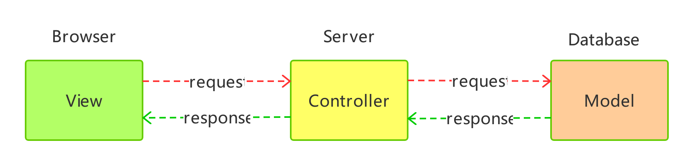

# MVC

- [核心](#核心)
- [MVC概念](#MVC概念)
- [相关的设计模式](#相关的设计模式)
  - [Observer模式](#Observer模式)
  - [Composite模式](#Composite模式)
  - [Strategy模式](#Strategy模式)
  - [Factory-Metchod](#Factory-Metchod)
  - [Decorator模式](#Decorator模式)
- [在用React开发时的相关模式](#在用React开发时的相关模式)
  - [哑组件概念与View的复用以及Composite](#哑组件概念与View的复用以及Composite)
  - [React的事件系统的设计](#React的事件系统的设计)
  - [Decorator模式与高阶组件](#Decorator模式与高阶组件)
  - [VM与Observer模式](#VM与Observer模式)
- [发展](#发展)
  - [后台MVC与前端MVC区别](#后台MVC与前端MVC区别)
    - [后台MVC](#后台MVC)
    - [前端MVC](#前端MVC)
  - [MVC-MVP-MVVM](#MVC-MVP-MVVM)
    - [MVP到MVVM](#MVP到MVVM)
    - [MVVM中的依赖倒置(DI)](#MVVM中的依赖倒置(DI))
  - [Redux](#Redux)
    - [优点](#优点)
    - [单一store的好处](#单一store的好处)
- [延伸](#延伸)
  - [multi-method与Visitor](#multi-method与Visitor)
- [参考资料](#参考资料)

## 核心

> 设计面向对象软件比较困难，而设计可复用的面向对象软件就更加困难。

关键是复用。

> 程序设计语言的选择非常重要，他将影响人们理解问题的出发点。我们的设计模式采用了Smalltalk和C++层的语言特性，这个选择设计上决定了那些机制可以方便的实现，而那些则不能。若我们采用过程式语言，可能就要包括诸如“继承”，‘封装’和“多态”的设计模式。

## MVC概念

> Model是应用对象，View是Model在屏幕上的表示，Controller是定义用户界面对用户输入的响应方式。

> 不使用MVC，用户界面设计往往将这些对象混在一起，而MVC则将他们分离以提高灵活性和复用性。

> MVC通过建立一个“订购/通知”协议来分离V和M(Observer模式)。

“订购/通知”协议保证V正确的反映M的状态。M一旦变化，V将相应刷新。由于“订购/通知”协议这层抽象的存在，使得我们可以为一个M提供不同的V，也可以为一个M创建新的V，而无需重写M。

> MVC的另一个特征是视图可以嵌套（Composite模式）。

我觉得，这里应该提一下V应该是可以复用的。V已经与M没有强关联了，那么V就可以用其他其他M上。

> MVC允许你在不改变视图外观的情况下改变视图对用户输入的响应方式。

> V使用Controller子类的实例来实现一个特定的响应策略。要实现不同的响应策略只要用不同的种类的C实例替换即可。

> V-C关系是Strategy模式的一个例子。

## 相关的设计模式

### Observer模式

M和V的分离的设计，需要实现M的改变，能够影响V，而M并不需要了解V的细节。如果是分离对象，使得一个对象的改变能影响另一个对象，这个对方不需要知道哪些被影响的对象的细节。

### Composite模式

组合视图和其构件平等对待。将一些对象划分为一组，并将该组对象当做一个对象来使用。

### Strategy模式

### Factory-Metchod

指定视图缺省控制器

### Decorator模式

增加视图滚动。

## 在用React开发时的相关模式

### 哑组件概念与View的复用以及Composite

### React的事件系统的设计

### Decorator模式与高阶组件

### VM与Observer模式

## 发展

### 后台MVC与前端MVC区别

#### 后台MVC

- 前端的view只是后台的数据映射。

- 只有一个数据源：数据库。也只有一种更新数据的方式：通过请求，到Controller（一般是Router）。

- View不包含状态。

#### 前端MVC

- 前端的状态不只包含后台的数据，还是前端特有的状态，如是否显示组件。这是后端数据不会包含的状态。前端的MVC中，与UI相关的，都是状态。

- 前端的View是可以直接访问Model的。

- Model一般来说有多个，不像后台只来源于数据库。

- View本身是可以包含状态的。

### MVC MVP MVVM

> MVC : 三连环，M向V之间可以直接传递，可以把 C晾在一边。C的可控性就比较低一点。

> MVP：三层之间不允许跨层调用。M向V的通知要经过C，V要暴露一堆接口给C ，C通过这些接口来操作。

> MVVM：三层之间也是不允许跨层调用。和楼主说的一样，为了解决业务复杂度上升的时候，V向C不停暴露过多接口的问题。采用依赖倒置的原则，即V不暴露接口给C，而是V采用C的模版语法去“映射"成C可以理解的操作。这就需要双向的数据绑定来完成“映射”。

#### MVP到MVVM

> 我从需求演变的角度再来帮楼主补充一下：

> 试想一下，传统的MVP, C当中有这样一个逻辑：先相加V当中window1， window2的数据，然后在显示在Panel 3上。C要写成data=V.GetWindow(1, "attr1") + V.GetWindow(2,"attr2")，然后再set回去，V.ShowPanel(data). V一共要暴露GetWindow ShowPanel 两个接口。如果再来一个需求要显示在Widget4上，V还得提供一个ShowWidget的接口。这样V就随着需求增加而无比庞大，增加很多接口。。。想想都是噩梦啊。。。

> 那么MVVM就来解放你了。V不再暴露接口，而是V和C之间商量一种模版语言，并且把这些数据映射到C上。这样你在Panel3 和Widget4的区域写上类似{{ Window1.attr1 + Windows2.attr2 }} 的语法（对应lz说的声明式编程吧），就能实现。这样再来需要显示Widget5,6,7 一样用类似语法，V根本不需要增加接口。

> V只需要把Window的数据绑定到VM(C)，让C知道如何去取数据计算结果即可。

> 在双向绑定这块既有传统的 观测者模式，也有angular $digest 模式(lazy的方式解决了传统观测者模式一有事件就不停通知的性能问题)

> 传统的MVP/MVC模式在提出来的时候还没有引入双向绑定模式 ，现在很多前端框架说自己是MVC或者MVP也有双向绑定。我个人认为那其实部分（甚至全部）已经实现MVVM的思想了（应该说框架的实现者已经意识到这样改进效果更好更能解决问题，只是没有套用MVVM的概念）。

#### MVVM中的依赖倒置(DI)

> 最主要的是我觉得MVVM采用了“依赖倒置“的思想，双向绑定和模版语言都是为了实现它而引入的。“依赖倒置”可以用于很多方面。这点倒是很值得我们学习。

> 倒置依赖"高层模块不应该依赖低层模块，二者都应该依赖其抽象；抽象不应该依赖细节；细节应该依赖抽象。" V 应该不依赖于C，因为V给C的暴露接口会越来越多（同理C也有可能越来越多）。 V和C之间通过 模版语言 约定一种通讯方式。模版语言就是抽象的接口，双向data binding 来通讯数据。 DI在这里的思想应用是确切，没有不妥啊。

> 结果是V 不需要再暴露过多接口，V的修改也不会影响到C（这也是你提到的“目前我们的公司的UI 开发，只是编写 CSS 和html ，他们没有办法编写js的 ”，因为他们也不需要编写js，他们编写的是抽象成一定范式后的模版表达式，告诉js怎么计算这个表达式即可 ）。

> 双方都依赖于稳定的模版语言。这就是 依赖倒置 思想 在这里是的应用。

> MVVM和MVC 直接我个人觉得不是简化的关系，而是思想的进步。MVC 是M和V 是之间反应不需要经过C。而MVVM , M和VM打交道，M看不到V。

> 而且MVVM 的实现依赖 双向data binding 。MVC的实现不需要依赖双向data binding。

### Redux

1. View不允许直接修改state
2. state统一放在单一的store
3. View发起action修改store

#### 优点

1. View可以做到很薄，如react的 dumb components；可以做到View=f(state)，View是纯函数；
2. 看store的变化，看注册的actions就可以了；
3. 任何状态必须由action触发，且是单向的，action必须经过dispatch。故所有状态的变更，会从同一个地方流过。这是与MVC不一样的地方。同时，这样可以方便做一些功能，如debug工具，历史回滚；

#### 单一store的好处

多个store存在不同store之间数据同步，和通信的问题。

## 延伸

### multi-method与Visitor

CLOS支持多方法(multi-method)的概念，这就减少了Visitor模式的必要性

## 参考资料

- [wiki MVC](https://zh.wikipedia.org/wiki/MVC)

- [Scaling Isomorphic Javascript Code](https://blog.nodejitsu.com/scaling-isomorphic-javascript-code/)

- [Understanding MVC And MVP (For JavaScript And Backbone Developers)](https://addyosmani.com/blog/understanding-mvc-and-mvp-for-javascript-and-backbone-developers/)

- 《Design Patterns -- elements of reusable Object-Oriented Software》

- [Why we are doing MVC and FLUX wrong](https://christianalfoni.herokuapp.com/articles/2015_08_02_Why-we-are-doing-MVC-and-FLUX-wrong)

- [如何理解 Facebook 的 flux 应用架构？](https://www.zhihu.com/question/33864532)

## change log

- 2019/9/17 created doc
- 2019/9/18 凌晨读四人帮的设计模式，并总结
- 2019/9/18 晚上，读公司内部KM相关文章，并总结
