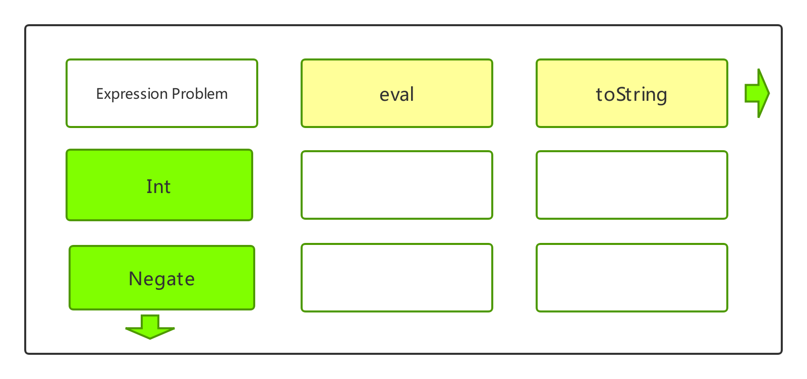
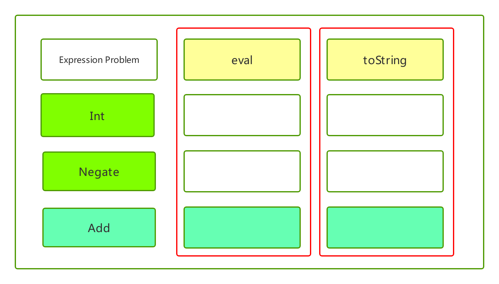
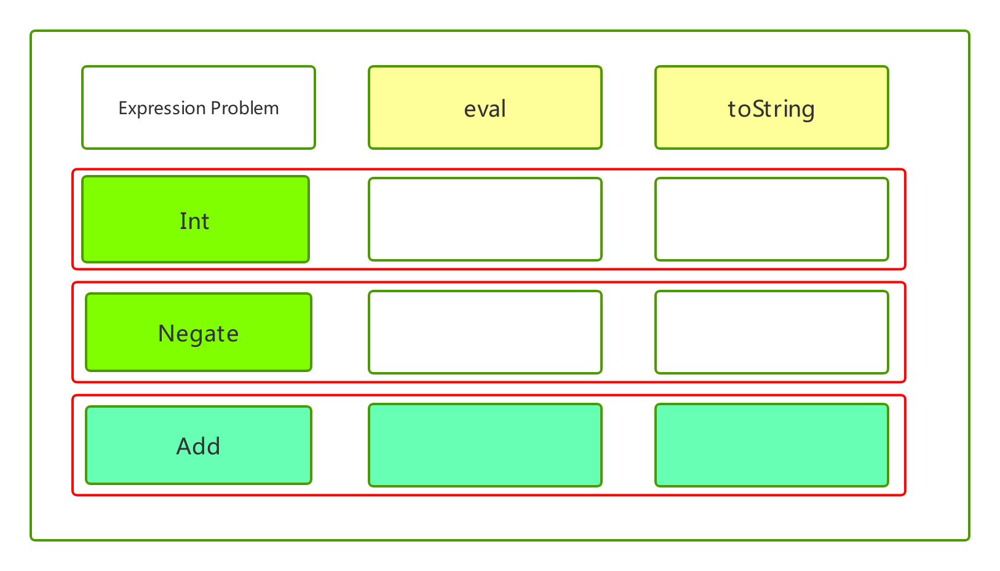
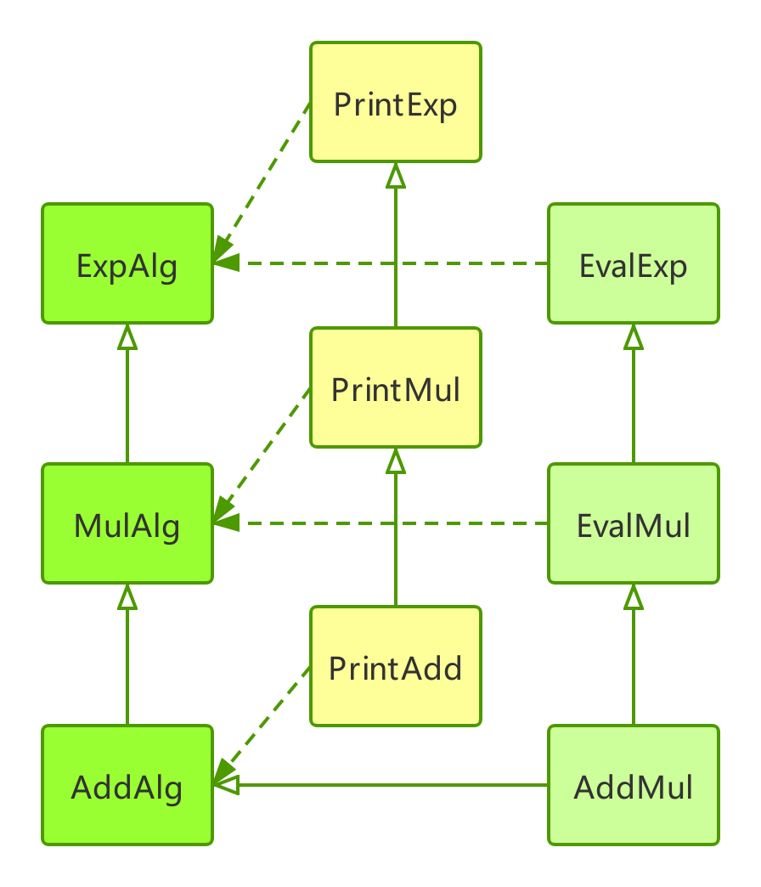
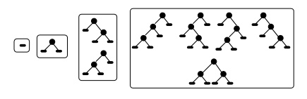
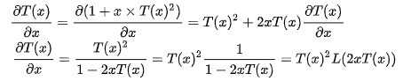
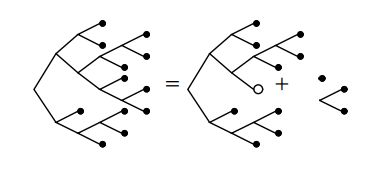

# Expression problem

> 密涅瓦的猫头鹰，只有在黄昏的时候才起飞
-- 黑格尔

> visitor，本质上是函数式编程语言里的含有“模式匹配pattern matching”的递归函数。
-- 王垠

> Java没有模式匹配，所以很多需要类似功能的人就得使用visitor pattern。为了所谓的“通用性”，他们往往把visitor pattern搞出多层继承关系，让你转几弯也搞不清楚到底哪个visitor才是干实事的。
-- 王垠

## expresssion problem 简介

> The Expression Problem is a new name for an old problem.  The goal is to define a datatype by cases, where one can add new cases to the datatype and new functions over the datatype, without recompiling existing code, and while retaining static type safety (e.g., no casts).  For the concrete example, we take expressions as the data type, begin with one case (constants) and one function (evaluators), then add one more construct (plus) and one more function (conversion to a string).
-- Philip Wadler



## OCaml

## variant

联合类型(sum)也称变体(variants)。

联合类型来源于集合论中的不相交并集(disjoint union)。这个概念不同于并集(union)。

两个集合A和B的并集是：`A∪B={x|x∈A∨x∈B}`

不相交并集是指两个集合中所有的元素都合并到一个集合中，并且每一个集合的元素都带有原集合的标记。可以表示为：

`A + B={(a, 0)|a∈A} ∪ {(b, 1)|b∈B}`

其中，0是A的标记，1是B的标记。0和1可以用任意符号代替。在OCaml中，不相交并集的每一个集合，该集合的特征的标识符来做这个集合的标记，这个标记用于构造联合类型中的一个元素，因此也称为联合类型的构造子(constructor)。“构造子”通常指用于构造某种语言成分的标识符。

构造子可以分为两类，一类带参数，另一类不带参数。后者称之为常量构造子，如：拥有常量构造子的联合类型相当于枚举类型，本身就是数据或者值。

以上引用自陈钢的《OCaml语言编程与基础教程》

### 变体(variant)实现expression

``` OCaml
(*定义表达式的类型：Int Negate Add*)
type exp =
  Int of int
| Negate of exp
| Add of exp * exp

(*实现求值*)
let rec eval  = function
  | Int i -> i
  | Negate e ->  -(eval e)
  | Add(e1, e2) -> (eval e1 ) + (eval e2)
(*实现把表达式转化为字符串*)
let rec toString = function
  | Int i -> string_of_int i
  | Negate e -> "-(" ^ (toString e) ^ ")"
  | Add(e1, e2)  -> "(" ^ (toString e1) ^ "+" ^ (toString e2) ^ ")"
;;
(*测试代码*)
let res = toString (Add ((Negate (Int 5)), (Int 6)));;
let num = eval (Add ((Negate (Int 5)), (Int 6)));;

```

variant实现的expression，表达式的类型是固定的，无法拓展。但操作可以随意添加，我们还可以添加其他操作，模式匹配保证了类型安全。如果操作支持的类型不全，模式匹配就会报错。



我们实现toString的时候，忘记实现`Add`的，模式匹配就会报错：

缺失`Add`实现toString的代码：
``` OCaml
let rec toString = function
  | Int i -> string_of_int i
  | Negate e -> "-(" ^ (toString e) ^ ")"
```

编译时的报错：

``` OCaml
File "exp.ml", line 11, characters 19-98:
11 | ...................function
12 |   | Int i -> string_of_int i
13 |   | Negate e -> "-(" ^ (toString e) ^ ")"
Warning 8: this pattern-matching is not exhaustive.
Here is an example of a case that is not matched:
```
### 多态变体(polymorphic variant)

常规变体需要先定义，再使用，且在其他变体中不能使用。多态变体，可以直接使用，且多个多态变体可以共享构造子名字，使得我们可以在多态变体类型的基础上拓展。这与OCaml对子类型(subtyping)的支持紧密相关。子类型会带来大量的复杂性。

多态变体缺点：
1. 复杂性
2. 错误查找。多态变体是类型安全的，不过由于其灵活性，他的类型约束不太可能捕获程序中的bug
3. 效率。OCaml为匹配多态变体时，无法向常规变体那样生成同样高效的代码

以上引用自《Real World OCaml》。

如果一个类A中的方法都包含在另一个类B中，则A和B之间具有子类型关系。子类(subtyping)关系是子类型关系的一种特殊情况。subtyping是面向对象编程中的一个核心概念。决定了C类型的对象什么时候可以用在原本需要D类型对象的表达式中。

### 多态变体(polymorphic variant)解决exprssion problem

使用多态变体实现exprssion，使得variant具有拓展能力。

``` OCaml
type exp =
  [`Int of int
  | `Negate of exp
  | `Add of exp * exp]

let rec eval  = function
  | `Int i -> i
  | `Negate e ->  -(eval e)
  | `Add(e1, e2) -> (eval e1 ) + (eval e2)

let rec toString = function
  | `Int i -> string_of_int i
  | `Negate e -> "-(" ^ (toString e) ^ ")"
  | `Add(e1, e2)  -> "(" ^ (toString e1) ^ "+" ^ (toString e2) ^ ")"

```

#### 多态变体的缺点

但也失去模式匹配和类型推导的好处，无法检测是否覆盖所有类型。

我们实现toString的时候，忘记实现`Add`的，模式匹配不再报错，可以直接通过编译。

缺少`Add`的`toString`实现：

``` OCaml
let rec toString = function
  | `Int i -> string_of_int i
  | `Negate e -> "-(" ^ (toString e) ^ ")"

```

这时，需要手动写明函数的类型，如

``` OCaml
let rec toString : exp -> string = function
  | `Int i -> string_of_int i
  | `Negate e -> "-(" ^ (toString e) ^ ")"
  | `Add(e1, e2)  -> "(" ^ (toString e1) ^ "+" ^ (toString e2) ^ ")"
```

此时，如果我们忘记实现`Add`的，就会报错：

``` OCaml
File "exp_exhaustive.ml", line 13, characters 35-116:
13 | ...................................function
14 |   | `Int i -> string_of_int i
15 |   | `Negate e -> "-(" ^ (toString e) ^ ")"
Warning 8: this pattern-matching is not exhaustive.
Here is an example of a case that is not matched:
`Add _
```

#### 多态变体的优点

多态变体就有可拓展性，可以用多态变体解决expression problem。

我们新增一种表达式。

``` OCaml
type new_exp = [ exp | `Sub of new_exp * new_exp]
```

支持eval求值操作和toString操作：

``` OCaml
let rec new_eval : new_exp -> int = function
  | #exp as exp -> eval exp
  | `Sub(e1, e2) -> (new_eval e1) - (new_eval e2)

let rec new_toString : new_exp -> string = function
  | `Sub(e1, e2) -> "(" ^ (new_toString e1) ^ "-" ^ (new_toString e2) ^ ")"
  | #exp as exp -> toString exp
```

完整可运行代码见附录。

## Java

我们用Java来解决expression problem。在Java中，expression用Class来声明。与函数式编程语言相反，Java中很方便新增expression，新增Class即可。但新增操作就很不方便，需要去修改每一个表达式的Class，逐一加上新操作。



解决这个拓展问题的办法是访问者模式(Visitor Pattern)。这个模式很厉害，是Friedman的《A Little Java, A Few Patterns》中讲解的模式。Friedman的Little系列的书，很厉害，如《The Little Typer》，讲dependently typed，如《The Little Schemer》，讲递归和Scheme。当然，系列书风格一致，类似于古希腊的柏拉图的《理想国》，很话痨，但很细致深刻。

### Visitor Pattern

我们把操作抽象出去，集合在Class中，然后把这个Class，用参数传递各个expression的方法里。

``` Java

interface Exp {
    <T> T accept(ExpVisitor<T> visitor);
}

interface ExpVisitor<T> {
    public T forLiteral(int v);
    public T forAdd(Exp a, Exp b);
}


// 定义expression
class Literal implements Exp {
    public final int val;

    public Literal(int val) {
        this.val = val;
    }

    public <T> T accept(ExpVisitor<T> visitor) {
        return visitor.forLiteral(val);
    }
}

// eval求值操作
class ExpEvalVisitor implements ExpVisitor<Integer> {
    @Override
    public Integer forLiteral(int v) {
        return v;
    }

    @Override
    public Integer forAdd(Exp a, Exp b) {
        return a.accept(this) + b.accept(this);
    }
}

```

显然在观察者模式中，新增操作非常容易，直接`implements ExpVisitor`即可。

完整代码见附录。

我们拓展一下这个实现，新增一种操作：除法Divide。

``` Java

// 拓展接口
interface ExpVisitor2<T> extends ExpVisitor<T> {
    public T forDivide(Exp a, Exp b);
}

interface Exp2 {
    public abstract <T> T accept(ExpVisitor2<T> visitor);
}

// 继承ExpEvalVisitor，拓展ExpEvalVisitor
class ExpEvalVisitor2 extends ExpEvalVisitor implements ExpVisitor2<Integer> {
    @Override
    public Integer forDivide(Exp a, Exp b) {
        return a.accept(this)  / b.accept(this);
    }
}
// 实现新的expression，除法
class Divide implements Exp2 {
    public final Exp a;
    public final Exp b;

    public Divide(Exp a, Exp b) {
        this.a = a;
        this.b = b;
    }

    public <T> T accept(ExpVisitor2<T> visitor) {
        return visitor.forDivide(a, b);
    }
}

```

### Object Algebras

在观察者模式中，expression的Class实现，还可以进一步简化抽象，直接省略此class。

``` Java

interface Exp<T> {
    public T literal(int v);
    public T add(T a, T b);
}


class Eval implements Exp<Integer> {
    @Override
    public Integer literal(int v) {
        return v;
    }

    @Override
    public Integer add(Integer a, Integer b) {
        return a + b;
    }
}

```

新增方法

``` Java

class Show implements Exp<String> {
    @Override
    public String literal(int v) {
        return v + "";
    }

    @Override
    public String add(String a, String b) {
        return "(" + a + "+" + b + ")";
    }
}

```

新增expression

``` Java

interface Exp2<T> extends Exp<T> {
    public T divide(T a, T b);
}

class Eval2 extends Eval implements Exp2<Integer> {
    @Override
    public Integer divide(Integer a, Integer b) {
        return a / b;
    }
}

```

完整可运行代码见附录。

以上实现，被称之为Object Algebras。

- Data type is generic factory interface
- Operation is factory implementation
- Easy to add variants(extend interface)
- Easy to add operations(implement interface)



通过extend和implement拓展原来的代码，Class之间有清晰的层次关系，我们可以类比Algebraic data types，这一系列的Class结构，和代数之间，也可以构造一个可逆映射(同构)。

## Church计数

《Structure and Interpretation of Computer Programs》一下简称SICP ，练习2.6，提及Church计数，考虑将0和加一的操作实现为：

``` scheme
(define zero (lambda (f) (lambda (x) x)))

(define (add-1 n)
    (lambda (f) (lambda (x) (f ((n f) x)))))
```

直接定义one和two。

``` scheme

(define one (add-1 zero))

(define one
    (lambda (f) (lambda (x) (f ((zero f) x)))))

(define one
    (lambda (f) (lambda (x)
        (f (((lambad (f) (lambad (x) x))) x)))))

(define one
    (lambda (f) (lambda (x)
        (f (((lambad () (lambad (x) x))) x)))))

(define one
    (lambda (f) (lambda (x)
        (f ((lambad (x) x) x)))))

(define one (lambda (f) (lambda (x) (f (lambad (x) x)))))

(define one (lambda (f) (lambda (x) (f x))))

```

数据的过程性表示。在程序设计中称之为消息传递。

一般而言，我们总可以将数据定义为一组适当的选择函数和构造函数，以及为使这些过程成为一套合法表示，它们就必选满足的一组特定条件。

这一思想严格地形式化却非常困难。目前存在着两种完成这一形式化的途径：抽象模型方法和代数规范。

由MIT的Zilles、Goguen和IBM的Thatcher、Wagner和Wright，以及Toronto的Guttag提出，称为代数规范。这一方式将“过程”看作是一个抽象代数系统的元素，系统的行为由一些对应于我们的“条件”的公理刻画，并通过抽象代数的技术去检查有关数据对象的短语。

以上引用自SICP。

## 代数数据类型(Algebraic data types)

### 代数数据类型与代数

代数数据类型（Algebraic data types），是一种组合类型，“代数”一词是因为有两种代数类型，主要是 Product 类型（如元组和记录，在代数上类似于笛卡尔乘）和 Sum 类型（如变体，在代数上类似于 Disjoint Unions，即交集为空集的集合的并操作）。代数类型在模式匹配中极为重要的。

正如其名，代数数据类型代表相应的数据结构应该满足一定的数学属性，利用相应的关系，我们可以用来证明类型实现的正确定，进一步证明程序的正确性。另一方法，它鼓励合理利用composition去构建更复杂的数据结构和算法。

OCaml有两种类型：记录类型(records)和联合类型(sums)。记录类型和C语言中的结构体(struct)类似，联合类型与C语言的(union)可以类比，但内容更为丰富。

C语言从存储分配角度解释结构体和联合体，OCaml则是从数学基础和语义角度解释记录类型和联合类型。记录类型是集合论中的笛卡尔积的推广，而联合类型则是不相交集合(disjion union)的推广。联合类型可用于构造枚举类型，也可以用于构造递归数据结构。表结构是递归数据结构的特例。

C语言的结构体和联合体内的分量是可以修改的，但OCaml的记录和联合体的分量，都是不可以修改的。内部结构不可以修改的数据类型称为函数式数据类型(funcitonal data structure)

以上引用自陈钢的《OCaml语言编程与基础教程》

类型(数据结构)和代数之间构造一个可逆映射(同构), 这就是为什么称为代数数据类型, 可以采用代数方式对类型进行运算。

类型可以定义为所有可接受值的集合

**空类型(Void)**: 不接受任何值, 映射至自然数0

**单位类型(Unit)**: 只接受一种可能值, 映射至自然数1

在类型上定义加法与乘法

- 加法: a + b = {x or y | x ∈ a, y ∈ b}

- 乘法: a * b = { (x , y) | x ∈ a, y ∈ b}  (笛卡尔乘积)

可以证明类型上的加法与乘法具有代数加法与乘法相同性质(交换律, 结合律, 分配律)。并且空类型为加法单位元, 单位类型为乘法单位元。

具体来说：

- 普通类型对应代数变量
- 数据构造器或 Tuple 对应求积
- `|` 操作符对于求和

即：

``` OCaml
Int                         <==>    int
MyType Int Int or (Int,Int) <==>    int*int
Left Int | Right Int        <==>    int+int

```

用这个关系，我们反推一下列表`[a]`的类型，列表要么是0个元素，1个元素，或者2个元素，如整数一样，以此类推....：

```
1 + a + a * a + a * a *a + ...
= 1 + a( 1 + a + a * a + ....)
```

可以看出，列表类型有不动点`f(x)=1 + a * x`或者循环不变式`1 + a * x`。

即列表有：

`List(TypeX) = Unit + TypeX * List(TypeX)`

得到：

`L(x) = 1 + x * L(x)`

解出可得：

`L(x) = 1 / (1 - x)`

考虑二叉树的类型：

`Tree(TypeX) = Unit + Unit * Tree(TypeX) ^ 2`

一颗树可以为空树, 包含0个节点, 为Unit, 或者一个元素(树根)下为左子树与右子树. 这个为二叉树的递归定义. 对应的代数形式:

`T(x) = 1 + x * T(x) ^ 2`

解方程，得到`T(x)`为：

`T(x) = (1 - (1 - 4 * x))/(2 *x)`

进行泰勒展开得到：

`T(x) = 1 + x + 2 * x ^ 2 + 5 * x ^ 3`

其中`x ^ n`(x的n次方)对应于总节点数为n的二叉树，系数表示所有可能树的结构数目：



###  二叉树(binary tree)

#### 二叉树的类型定义

陈钢的《OCaml语言编程与基础教程》（2018.6版本）第70页，定义的二叉树类型是错误的，缺失节点的元素。

- 错误的二叉树定义

``` OCaml

type inttree = Leaf of int | Node of inttree * intree

```

- 错误的用多态变量定义的二叉树

``` OCaml
type 'a tree =
| Leaf
| Node of 'a tree * 'a tree

```

- binary tree

``` OCaml
type 'a tree =
| Leaf
| Node of 'a * 'a tree * 'a tree

```

- list

``` OCaml

type 'a mylist =
| Nil
| Cons of 'a * 'a mylist

```

二叉树和list的类型定义，使用联合类型(sums)构造的递归数据类型。我们可以看到，二叉树和表都是递归数据结构。

构造一个简单的二叉树

``` OCaml
(* the code below constructs this tree:
         4
       /   \
      2     5
     / \   / \
    1   3 6   7
*)
let t =
  Node(4,
    Node(2,
      Node(1,Leaf,Leaf),
      Node(3,Leaf,Leaf)
    ),
    Node(5,
      Node(6,Leaf,Leaf),
      Node(7,Leaf,Leaf)
    )
  )

```

求二叉树的深度

``` OCaml

let rec size = function
| Leaf -> 0
| Node (_, l, r) -> 1 + size l + size r

```

### Zipper与求导

函数式程序设计中，不允许修改数据，只能创建新的数据达成修改的目的。当数据很大的情况下，复制原来的数据，并修改之，得到新数据，成本很高。还有一个办法，就是只修改需要修改的局部即可，复用旧数据创建新数据。避免了deepCopy复制带来的消耗。


要达到这个目的，需要知道类型的局部特征。

求导产生了一个新的类型, 这个类型正好是原类型中从中挖去一个元素留下一个洞(Unit)的类型(One-Hole Contexts)。 这种类型在函数式编程语言里非常有用, 对该类型乘元素类型补全, 将得到与原类型结构相同并同时拥有局部性的类型。

举个例子，包含三个整数的积类型： `int*int*int` ，或者 `int ^ 3`的三次方，用tuple的表示法就是 `(Int, Int, Int)` ，要挖个洞的话有三种挖法：

``` OCaml
(_, int, int)
(int, _, int)
(int, int, _)
```

即`int*int + int*int + int*int`，加起来之后，即`3 * int * int`，即`3 * int ^ 2`。正好是`a ^ 3`求导的结果`3 * a ^ 2`。

对于二叉树有：挖去元素后列表断开, 剩下以该节点为树根的左右子树和从树根到该节点的路径上的每一个节点与其非路径节点的子树构成的列表, 路径上的每一个节点的非路径节点子树有两种可能(左或右子树)。





即为:
`T(x)^2*L(2xT(x))T(x)^2`为该节点下的左右子树。
`L(2xT(x))`为一个列表, 记录从树根到该节点的路径, 列表里的每一个元素类型为`2xT(x)2xT(x)`, x为路径上的一个节点, `T(x)`为该节点相连的非路径节点的子树, 2表示该非路径节点的子树应为左子树或右子树.

对于一个代数式进行求导有明确的分析意义. 但对于一个类型进行求导的直观意义就非常微妙了, 得到的是带有洞的新类型. 这之间的联系也许是"巧合", 也许揭示了类型与分析之间存在更为深刻的关联.


## 循环不变式

命题=类型(Propositions as Types)，程序=证明。


> 我认为程序员可以被分为两种：
> 1. 先确认前条件/不变式/终止条件/边界条件，然后写出正确的代码
> 2. 先编写代码，然后通过各种用例/测试/调试对程序进行调整，最后得到似乎正确的代码
> 我个人保守估计前者开发效率至少是后者的 10 倍，因为前者不需要浪费大量时间在**编码-调试-编码**，这个极其耗时的循环上。

《算法导论》(Introduction to Algorithms)的第二章“算法基础”，2.1节插入排序“循环不变式与插入排序的正确性”。

循环不变式主要用来帮助理解算法的正确性。形式上很类似与数学归纳法，它是一个需要保证正确断言。对于循环不变式，必须证明它的三个性质：

《算法导论》中的循环不变式的概念与性质：

**初始化**：循环的第一轮迭代开始之前，为真

**保持**：如果在循环的某一次迭代开始之前为真，那么在下一次迭代开始之前仍为真

**终止**：在循环终止时，不变式为我们提供一个有用的性质，该性质有助于证明算法是正确的

> 类似于数学归纳法，其中为了证明某条性质成立，需要证明一个基本情况和一个归纳步。

> 第三条性质也行最重要，因为我们将使用循环不变式来证明正确性。通常，我们和导致循环终止的条件一起使用循环不变式。终止性不同于我们通常使用数学归纳法的做法，在归纳法中，归纳步是无限使用的，这里当循环终止时，停止“归纳”。

分析插入排序：

``` Java
//将arr[i] 插入到arr[0]...arr[i - 1]中
public static void insertion_sort(int[] arr) {
    for (int i = 1; i < arr.length; i++ ) {
        int temp = arr[i];
        int j = i - 1;
        //如果将赋值放到下一行的for循环内, 会导致在第10行出现j未声明的错误
        for (;j >= 0 && arr[j] > temp; j-- ) {
            arr[j + 1] = arr[j];
        }
        arr[j + 1] = temp;
    }
}
```

下标j指出需要排序的元素，而`arr[0...j-1]`已经排序了。把`arr[i]`插入其中即可。在迭代中这个性质保持不变，我们把`A[0...j-1]`的这些性质，形式的表示为**循环不变式**。

1. 初始化：当`j = 0,1,2`时显然成立
2.  保持：内部for循环，把索引小于j的元素，右移一位，直到找到`arr[j]`的适当位置，然后插入此位置。此时，子数组`arr[0...j]`，已按照顺序排列。保持了循环不变式。
3. 终止：当i大于`arr.length`时，终止。即`j = arr.length`。此时，`j = arr.length`，有：子数组`arr[0..arr.lenght]`已经按顺序排列。即，整个数组已排序。因此，算法正确。

## 反思

### 误导的技术文章

 Mu Xian Ming的OOP vs FP：用 Visitor 模式克服 OOP 的局限》中错误的OCaml实现：

``` OCaml
exception BadResult of string
type exp =
    Int    of int
  | Negate of exp
  | Add    of exp * exp
let rec eval e =
  match e with
      Int _      -> e
    | Negate e1  -> (match eval e1 with
                        Int i -> Int (-i)
                      | _ -> raise (BadResult "non-int in negation"))
    | Add(e1,e2) -> (match (eval e1, eval e2) with
                        (Int i, Int j) -> Int (i+j)
                      | _ -> raise (BadResult "non-ints in addition"))
let rec toString = function
    Int i      -> string_of_int i
  | Negate e1  -> "-(" ^ (toString e1) ^ ")"
  | Add(e1,e2) -> "(" ^ (toString e1) ^ " + " ^ (toString e2) ^ ")"
let rec hasZero = function
    Int i      -> i = 0
  | Negate e1  -> hasZero e1
  | Add(e1,e2) -> (hasZero e1) || (hasZero e2)
;;
toString (eval (Add ((Negate (Int 5)), (Int 6))))
(* - : string = "1" *)
```

以上代码用于举例说明，在expression problem这个场景中，函数式程序设计，易于增加方法，不易于增加类型。后面有一到两个星期，我都在思考，怎么拓展这段代码，用OCaml解决expression problem。

而作者给出的解决方案，看起来似乎可行，可是实际上是错上加错。

> 对于函数式模式来说，可以在类型定义中增加一个“其他”的类型，然后所有的函数都接受一个额外的函数类型的参数来处理“其他”的数据类型。

``` OCaml
type ’a ext_exp =
    Int    of int
  | Negate of ’a ext_exp
  | Add    of ’a ext_exp * ’a ext_exp
  | OtherExtExp  of ’a
let rec eval_ext (f, e) =
  match e with
      Int i -> i
    | Negate e1 -> 0 - (eval_ext (f, e1))
    | Add (e1, e2) -> (eval_ext (f, e1)) + (eval_ext (f, e2))
    | OtherExtExp e -> f e
```

第一次看到这段代码，以为用这种额外通用的办法是可以的。由于我函数式编程语言中，实际能编程的只有Scheme和OCaml，很多文章讲解expression problem都是用Haskell，而Haskell的处理是其语言的思路，根本不能借鉴到OCaml中。

于是研究这个篇文章中的代码，花了很多时间，改模式匹配的代码，越改越复杂，生成非常复杂的类型错误。后面阅读到cornell CS 3110课程PPT，才恍然大悟，这个博客里最初的代码就是错误的，模式匹配根本就不对，而作者为了掩盖模式匹配错误，给每一个函数都加上了`_`匹配，然后扔掉，导致也不会报错。而正常的expression能匹配到其中正常的模式，使得这段有问题的代码，也能正常工作。这就造成了我当时百思不得其解的困境：我怀疑模式匹配写得有问题，可是他可以正常工作；当我试图修改这个代码，解决expression problem问题，无论怎么修改，模式匹配都是有问题的，且遇到非常复杂的类型报错。不可谓不坑。

看这个作者的其他文章，应该对PL有所研究的人，可写出来的OCaml代码，模式匹配错误得一塌糊涂。同时，由于我对这个领域不熟悉，这算是初次有动手的尝试，之前只是看看别人的文章。万事开头难。

### 错误的文章

Anders Janmy 的《Solving the Expression Problem in Javascript》，试图用JavaScript解决expression problem，而JS的类型(dynamic style)显然不足以实现一个类型安全的代码。得益于JS的语言可以随意给对象或构造函数添加protype，JS实现expression，并具有拓展性，是很容易的事情。但这个显然意义不大，我们需要的是类型安全的实现。

不过，这倒是可以看出JS不足以及优点。姑且记录一下其实现。

> Now lets solve it with Javascript in a dynamic style. The solution we have looks a lot like the subtype polymorphic solution above.

``` JavaScript

function Add(e1, e2) {
    this.e1 = e1;
    this.e2 = e2;
}
Add.prototype.value = function() { return this.e1.value() + this.e2.value(); };

function Sub(e1, e2) {
    this.e1 = e1;
    this.e2 = e2;
}
Sub.prototype.value = function() { return this.e1.value() - this.e2.value(); };

function Num(n) {
    this.n = n;
}
Num.prototype.value = function() { return this.n; };


```

> But, what about adding a new functions? It turns out that this is just as easy because of the dynamic nature of Javascript. We just add them to the prototype.

``` JavaScript
// Adding new functions to existing prototypes
Add.prototype.toString = function() {
  return '(' + this.e1.toString() + ' + ' + this.e2.toString() + ')';
}
Sub.prototype.toString = function() {
  return '(' + this.e1.toString() + ' - ' + this.e2.toString() + ')';
}
Num.prototype.toString = function() {
  return '' + this.n;
}
Mul.prototype.toString = function() {
  return '(' + this.e1.toString() + ' * ' + this.e2.toString() + ')';
}
```
> Now getting a string representation of an expression is a simple as:

``` JavaScript
var x = new Num(1);
var y = new Num(2);
var z = new Add(x, y);
var w = new Sub(x, y);
var e = new Mul(z, w);

e.toString(); // returns ((1 + 2) * (1 - 2))
```

### 概念的本质

我觉得这个问题与subtyping，有深刻的联系，而subtyping我目前不能深入研究，暂且记录在这里，以后补上。估计要到读完《The Little Typer》以后。

## 参考资料

### 前端

- [Immutable 详解及 React 中实践](https://github.com/camsong/blog/issues/3)

### design patterns

- [编程的宗派](https://www.yinwang.org/blog-cn/2015/04/03/paradigms)

- [解密“设计模式”](https://www.yinwang.org/blog-cn/2013/03/07/design-patterns)

- [OCaml: Match expression inside another one?](https://stackoverflow.com/questions/257605/ocaml-match-expression-inside-another-one)

### Visitor Pattern and Finally Tagless

- [完全放弃ADT和record，拥抱polymorphic variant和row是否可行？](https://www.zhihu.com/question/310754155)

- [OOP vs FP：用 Visitor 模式克服 OOP 的局限](http://mxm.ink/post/2018-07-31-oop-vs-fp/)

- [Visitor Pattern 与 Finally Tagless：解决表达式问题](https://ice1000.org/2019/01/01/FinallyTaglessVisitorPattern/)

- [使用 Object Algebra 改善解释器代码设计](https://zjuwyd.com/2018/10/03/ObjectAlgebra/)

- [Visitor Pattern](https://zhuanlan.zhihu.com/p/35987864)


### expression problem

- [Expression problem wiki](https://en.wikipedia.org/wiki/Expression_problem)

- [Expression Problem的现状如何？](https://www.zhihu.com/question/314310650)

- [Greenspunning Predicate and Multiple Dispatch in JavaScript](http://raganwald.com/2014/06/23/multiple-dispatch.html)

- [Solving the Expression Problem in Javascript](https://blog.jayway.com/2013/06/21/15201/)

- [单分派、双分派及两种设计模式 Java](https://juejin.im/post/5d79fabb6fb9a06b1777e2fd)

- [The Expression Problem and its solutions C++](https://eli.thegreenplace.net/2016/the-expression-problem-and-its-solutions/)

- [Extensibility for the Masses Practical Extensibility with Object Algebras](https://www.cs.utexas.edu/~wcook/Drafts/2012/ecoop2012.pdf)

- [The expression problem as a litmus test](http://ane.github.io/2016/01/08/the-expression-problem-as-a-litmus-test.html)

- [expression_problem_1.ml](https://github.com/rizo/lambda-lab/blob/master/expression-problem/ocaml/expression_problem_1.ml)

- [Expression problem](https://en.wikipedia.org/wiki/Expression_problem)

- [Extending an existing type in OCaml](https://stackoverflow.com/questions/1746743/extending-an-existing-type-in-ocaml)

- [Expression problem Code](http://caml.inria.fr/cgi-bin/viewvc.cgi/ocaml/trunk/testlabl/mixin.ml?diff_format=c&view=markup&pathrev=10238)

## change log

- 2019/9/20 created doc

- 2019/9/22 补充参考资料

- 2019/9/30 完成OCaml版本的Finally Tagless的版本理解，可以开始写OCaml部分了

- 2019/10/11 完成OCaml的expression problem例子，补充参考资料

- 2019/10/12 完成正确的OCaml的expression problem的实现，直接参考别人的博客写代码，被坑了半个月。也是由于我对OCaml不熟悉，加上心急，被这个博客的作者气死了，瞎写代码。

- 2019/10/20 合并visitor模式文档

- 2019/10/28 凌晨1点，完成代数和循环不变式

- 2019/10/29 凌晨1点，完成OCaml多态类型部分，并学习subtyping概念

- 2019/10/29 晚上10点，完成文章的初稿。研究这个课题，一个月有余

## 附录

### 完整代码

### OCaml Expression Problem

``` OCaml
type exp =
  Int of int
| Negate of exp
| Add of exp * exp

let rec eval  = function
  | Int i -> i
  | Negate e ->  -(eval e)
  | Add(e1, e2) -> (eval e1 ) + (eval e2)

let rec toString = function
  | Int i -> string_of_int i
  | Negate e -> "-(" ^ (toString e) ^ ")"
  | Add(e1, e2)  -> "(" ^ (toString e1) ^ "+" ^ (toString e2) ^ ")"

;;


let res = toString (Add ((Negate (Int 5)), (Int 6)));;
let num = eval (Add ((Negate (Int 5)), (Int 6)));;
print_endline res;;
print_endline (string_of_int num);;
```

### OCaml polymorphic variant

``` OCaml

exception BadResult of string

type exp =
  [`Int of int
  | `Negate of exp
  | `Add of exp * exp]

let rec eval  = function
  | `Int i -> i
  | `Negate e ->  -(eval e)
  | `Add(e1, e2) -> (eval e1 ) + (eval e2)

let rec toString = function
  | `Int i -> string_of_int i
  | `Negate e -> "-(" ^ (toString e) ^ ")"
  | `Add(e1, e2)  -> "(" ^ (toString e1) ^ "+" ^ (toString e2) ^ ")"

type new_exp = [ exp | `Sub of new_exp * new_exp]

let rec new_eval : new_exp -> int = function
  | #exp as exp -> eval exp
  | `Sub(e1, e2) -> (new_eval e1) - (new_eval e2)

let rec new_toString : new_exp -> string = function
  | `Sub(e1, e2) -> "(" ^ (new_toString e1) ^ "-" ^ (new_toString e2) ^ ")"
  | #exp as exp -> toString exp

;;

let a = `Int 10
let b = `Int 6
let c = `Sub(a, b)
let d = new_eval c
;;
print_endline (string_of_int d);;

let res = toString (`Add ((`Negate (`Int 5)), (`Int 6)));;
let num = eval (`Add ((`Negate (`Int 5)), (`Int 6)));;
print_endline res;;
print_endline (string_of_int num);;

```

### Java Visitor pattern

``` Java

package siegel.visitor;

public class VisitorPattern {
    public static void main(String[] args) {
        System.out.println("nice!");
        Exp exp1 = new Add(new Literal(1), new Literal(2));
        int res = exp1.accept(new ExpEvalVisitor());
        String show = exp1.accept(new ExpShowVisitor());
        System.out.println("eval reslut:" + res);
        System.out.println("show reslut:" + show);


        Exp exp2 = new Add(new Literal(2), new Literal(2));
        Exp2 exp3 = new Divide(exp1, exp2);
        int res4 = exp3.accept(new ExpEvalVisitor2());
        System.out.println("divide eval reslut:" + res4);
    }
}


interface Exp {
    <T> T accept(ExpVisitor<T> visitor);
}

interface ExpVisitor<T> {
    public T forLiteral(int v);
    public T forAdd(Exp a, Exp b);
}


class Literal implements Exp {
    public final int val;

    public Literal(int val) {
        this.val = val;
    }

    public <T> T accept(ExpVisitor<T> visitor) {
        return visitor.forLiteral(val);
    }
}

class Add implements Exp {
    public final Exp a;
    public final Exp b;

    public Add(Exp a, Exp b) {
        this.a = a;
        this.b = b;
    }

    public <T> T accept(ExpVisitor<T> visitor) {
        return visitor.forAdd(a, b);
    }
}

class ExpEvalVisitor implements ExpVisitor<Integer> {
    @Override
    public Integer forLiteral(int v) {
        return v;
    }

    @Override
    public Integer forAdd(Exp a, Exp b) {
        return a.accept(this) + b.accept(this);
    }
}

class ExpShowVisitor implements ExpVisitor<String> {
    @Override
    public String forLiteral(int v) {
        return v + "";
    }

    @Override
    public String forAdd(Exp a, Exp b) {
        return "(" + a.accept(this) + "+" + b.accept(this) + ")";
    }
}

interface ExpVisitor2<T> extends ExpVisitor<T> {
    public T forDivide(Exp a, Exp b);
}

interface Exp2 {
    public abstract <T> T accept(ExpVisitor2<T> visitor);
}

class ExpEvalVisitor2 extends ExpEvalVisitor implements ExpVisitor2<Integer> {
    @Override
    public Integer forDivide(Exp a, Exp b) {
        return a.accept(this)  / b.accept(this);
    }
}


class Divide implements Exp2 {
    public final Exp a;
    public final Exp b;

    public Divide(Exp a, Exp b) {
        this.a = a;
        this.b = b;
    }

    public <T> T accept(ExpVisitor2<T> visitor) {
        return visitor.forDivide(a, b);
    }
}


```

### Java object Algebras

``` java

package siegel.objectAlgebras;

public class ObjectAlgebras {
    public static void main(String[] args) {
        System.out.println("nice!");
        Eval e = new Eval();
        int res = e.add(e.literal(1), e.literal(2));
        System.out.println("result: " + res);

        Eval2 e2 = new Eval2();
        int res2 = e2.divide(e2.literal(4), e2.literal(2));
        System.out.println("2 result: " + res2);
    }
}


interface Exp<T> {
    public T literal(int v);
    public T add(T a, T b);
}


class Eval implements Exp<Integer> {
    @Override
    public Integer literal(int v) {
        return v;
    }

    @Override
    public Integer add(Integer a, Integer b) {
        return a + b;
    }
}

class Show implements Exp<String> {
    @Override
    public String literal(int v) {
        return v + "";
    }

    @Override
    public String add(String a, String b) {
        return "(" + a + "+" + b + ")";
    }
}

interface Exp2<T> extends Exp<T> {
    public T divide(T a, T b);
}

class Eval2 extends Eval implements Exp2<Integer> {
    @Override
    public Integer divide(Integer a, Integer b) {
        return a / b;
    }
}

```
