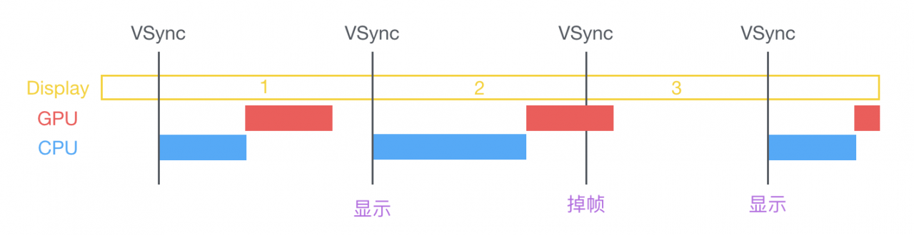
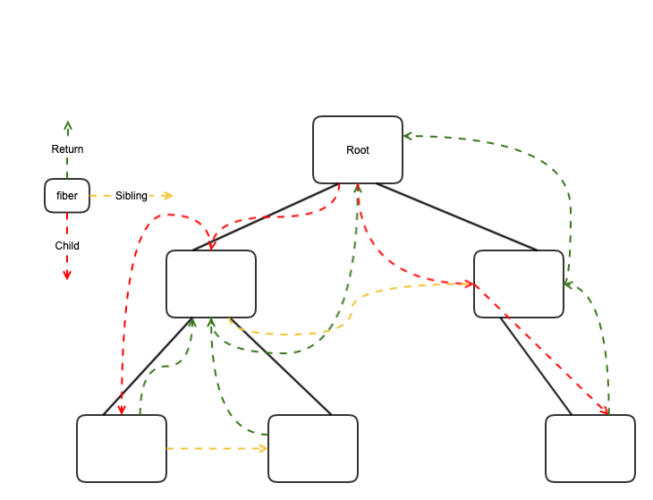

# Browser rendering

## GPU/CPU of frame per second

### frame per second

显示器刷新频率限制了浏览器的最高刷新频率，一般情况下只能每秒60帧(frame per second, 简称FPS)。显示器的刷新频率，即显示器上渲染的元素（如图片）每秒出现的次数，一般电脑是60Hz。也就是，当什么也不做的时候，或者操作电脑的时候，显示器以这个频率渲染，不断更新屏幕上的图像。

利用浏览器做动画，要求以连续的、平滑的线性方式实现，这样视觉上才不会卡顿。即不能丢帧。

浏览器的渲染，受系统（GPU或CPU）和显示器刷新频率，两者的影响。显示器一般16.7ms（1000/60ms）来绘制每一帧，而GPU刷新频率则不确定。因此渲染不是连续的，而是离散的，是浏览器渲染的很多问题的根源，特别是动画的渲染问题。

GPU的频率可以大于显示器的刷新频率。就可能出现，GPU渲染在显示器的一个时钟周期渲染多次，实际上只有一次能在显示器上呈现。PC游戏中解决这个问题办法是使用`v-sync`。GPU妥协，必须在显示器两次刷新中间渲染。代价是降低了GPU输出频率，即降低渲染的帧数。



由于渲染是离散的，渲染的时机，和渲染的耗时，会影响渲染效果。

#### 1. 时机的影响：

```
               15.6ms     15.6ms    15.6ms
clock:     |----------|----------|----------|
                  frame1  frame2 frame3
animation: ------|------|------|------|------

```

animation的frame(`<15.6ms`)以相同的周期触发了三次渲染，中间的frame2没来得及渲染，就触发frame3，导致frame3丢帧了。如果能控制frame2的触发时机，比如在第三个时钟周期触发，就可以避免这个问题。requestAnimationFrame可以解决这个问题，其功能是能找到合适的时间点执行动画。


#### 2. 渲染耗时的影响：

```
               15.6ms     15.6ms    15.6ms
clock:     |----------|----------|----------|
                         frame1
animation: ------|-------------------|--------

```

animation的frame(`<15.6*2ms`)，第一个、第二个时钟周期都没来及渲染，导致动画看起来不流畅。这种情况，一般来说是重绘和重排等大量耗时操作导致。低优先级的任务，requestIdleCallback可以缓解这个问题，其功能是选择浏览器的idle时间，来执行任务。也可以利用这个API实现，把一个大任务，分片执行，如React Fiber和React Scheduler。


### setTimeout和setInterval的问题

- tab已不可见，以及触发频率高于显示器渲染频率(见上文情况1)，这两种情况下的过度渲染问题
- 由于硬件或浏览器不同，性能不一样，如何确定确定合适的动画的时间间隔（见上文情况2）
- 依赖浏览器的内置时钟，其更新频率会导致毫秒的不精确

#### setTimeout和setInterval的时间精度不够

两者依赖浏览器内置时钟，内置时钟依赖时钟更新频率。
Chrome与IE9+浏览器时钟更新频率为4ms。
IE8及其之前的版本，更新间隔为15.6毫秒。如果我们设置setTimeout延迟为16.7ms，在IE8上执行过程，如下图：

```
                16.7ms
setTimeout: |------------|

                 15.6ms  15.6ms
clock:      |----------|----------|

```

15.6 * 2 - 16.7 = 14.5ms，会被延迟了14.5ms。


#### 任务队列问题

JavaScript是单线程语言，一次只能执行一个任务。如果有有多个任务，则需要排队处理。同步任务，则一次串行执行。异步任务，则进入task queue任务队列，主线程空了，则读取任务队列，执行之。

队列种类：

- `macro-task`：普通JS代码，`setTimeout, setInerval, setImmediate`，UI渲染，I/O
- `micro-task`：原生Promise，`Object.observe`，`MutationObserver`， `process.nextTick`

执行顺序：

普通JS代码 => `micro-task` => `macro-task`。

1. 从普通JS代码开始执行，执行完主线上JS之后
2. 查看`micro-task`队列中任务，如果有，则依次执行，直到执行完毕。如果无，则执行3
3. 之后才去查看`macro-task`，每次执行`macro-task`，会查看`micro-task`，如果有，则执行2

代码例子：

``` JavaScript
console.log('script start');

setTimeout(function() {
  console.log('setTimeout');
}, 0);

Promise.resolve().then(function() {
  console.log('promise1');
}).then(function() {
  console.log('promise2');
});

console.log('script end');

// script start
// script end
// promise1
// promise2
// setTimeout

```


## requestIdleCallback

``` JavaScript

class nonEssentialWork {
    constructor(task, timeout) {
        this.tasks = task || [];
        this.timeout = timeout || 0;
    }

    getTasks = () => {
        return this.tasks;
    }

    push = (task) => {
        this.tasks.push(task);
    }

    clean = () => {
        this.tasks = [];
    }

    main = () => {
        let timeout = this.timeout;
        requestIdleCallback((deadline) => {
            while((deadline.timeRemaining() > 0 || deadline.didTimeout) && this.tasks.length > 0) {
               this.tasks.pop()();
            }
            if (this.tasks.length > 0) {
                requestIdleCallback(this.main, {timeout});
            }
        }, {timeout});
    }
};

```

## requestAnimationFrame

实现动画的时候，requestAnimationFrame替代了setTimeout和setInterval等定时器，主要解决了渲染时机问题（见上文）。

### 如何实现动画

例子来源：十年踪迹

``` html

<style>
  #block{
    position:absolute;
    left: 200px;
    top: 200px;
    width: 100px;
    height: 100px;
    background: #0c8;
    line-height: 100px;
    text-align: center;
  }
</style>
<div id="block">click me</div>
```

``` JavaScript
var deg = 0;
block.addEventListener('click', function(){
    requestAnimationFrame(function change(){
        block.style.transform = 'rotate(' + (deg++) +'deg)';
        requestAnimationFrame(change);
    });
});

```

#### 把时间作为一个线性的增量

时间均匀线性递增，以此来影响动画维度值的变化，这里是deg的线性递增。从物理角度来看，这里定义了一个速度，并对速度求积分，得到了位移。

注：无论是setTimeout还是requestAnimationFrame都无法做到以固定的时间间隔执行动画，受浏览器时钟和显示器渲染刷新频率影响，具体原因见上文。这里为了阐述问题，假设API有此能力，实际上无此能力，对此种实现影响更糟糕。

会产生两个问题：

- 变速运动不易处理，要找到适当的求积分的速度
- 中间被其他耗时任务阻塞，导致动画变慢

``` JavaScript
var deg = 0;
block.addEventListener("click", function(){
  setInterval(function(){
    var i = 0;
    var t = Date.now();
    while(++i < 200000000); //模拟耗时操作
    console.log(Date.now() - t);
  }, 100);

  var self = this;
  requestAnimationFrame(function change(){
    self.style.transform = "rotate(" + (deg++) +"deg)";
    requestAnimationFrame(change);
  });
});

```

#### 位移是时间的函数`s=f(t)`

使用流逝的时间点来处理位移，而非假设的均匀线性的时间增量。这样阻塞之后，动画不变慢，而是掉帧。对变速运动也易处理，使用物理学公式即可，如匀加速运动`s = v0*t + (1/2)*a*t^2`

``` JavaScript

block.addEventListener("click", function(){
  var self = this, startTime = Date.now(),
      duration = 1000;
  requestAnimationFrame(function change(){
    var p = (Date.now() - startTime) / duration;
    self.style.transform = "rotate(" + (360 * p) +"deg)";
    requestAnimationFrame(change);
  });
});

```

对比利用时间点相减和以时间增量来实现动画

|功能| 时间 | 增量 |
| :------|:------: |:------: |
|时间控制|√|X|
|不延迟|√|X|
|不掉帧|X|√|


## React Fiber and React Scheduler

Fiber是一种调度算法(Fiber reconciler)，使用requestIdleCallback实现，React用requestAnimationFrame模拟实现。解决无多线程操作带来的问题。

DOM的树形结构，以及其包含的大量数据，保证其顺序执行，且不影响主线程的UI渲染。从Root开始，遍历tree结构，到达叶子节点，则回到父节点，以链表的形式链接起来，如下图：



优点：

- 不用递归处理DOM树，循环即可。相比递归的栈，只需多了额外内存保存信息
- 有了此层的抽象，可以将Diff任务以及创建DOM的任务，分片执行之。异步渲染，虽然持续时间长，但只有最后变更的时候，一次性插入DOM

JavaScript与UI渲染互斥，执行JavaScript则阻塞了UI渲染。如果JavaScript运行时间长，则会明显阻塞渲染，导致掉帧。

本质上React的Fiber是将任务分片为小任务，在16ms中的渲染的空闲时间执行。从而避免掉帧的问题。

### 与协程的Fiber有差异

有栈协程的Fiber。协程的任务一直会占用线程，直到用户返回。在事件循环和异步IO模型中，协程性能较好，且可以使用Future模式（Promise），把异步编程带来的问题消除。

浏览器的无栈协程：generator, Promise和async+await

### webAssembly与Fiber

来自Hacker News的讨论：

crudbug:
> Is there plan to implement the react-core in C or other native language ?
I can see that being compiled to webassembly for browsers and react-native can have multiple language support ?

danabramov:
> think my talk paints a relatively convincing picture why DOM nodes aren’t a sufficient primitive if you care about the features I described, as you’d need something like React to orchestrate those updates
>


## 参考资料

- [Javascript 高性能动画与页面渲染](https://www.infoq.cn/article/javascript-high-performance-animation-and-page-rendering)

- [完全理解React Fiber](http://www.ayqy.net/blog/dive-into-react-fiber/)

- [Inside Fiber: in-depth overview of the new reconciliation algorithm in React](https://medium.com/react-in-depth/inside-fiber-in-depth-overview-of-the-new-reconciliation-algorithm-in-react-e1c04700ef6e)

- [React16源码之React Fiber架构](https://github.com/HuJiaoHJ/blog/issues/7)

- [从 event loop 规范探究 javaScript 异步及浏览器更新渲染时机](https://juejin.im/entry/59082301a22b9d0065f1a186)

- [你应该知道的requestIdleCallback](https://juejin.im/post/5ad71f39f265da239f07e862)

- [Using requestIdleCallback ](https://developers.google.com/web/updates/2015/08/using-requestidlecallback)

- [【译】使用requestIdleCallback](https://div.io/topic/1370)

- [浅谈React Scheduler任务管理](https://zhuanlan.zhihu.com/p/48254036)

- [网页性能管理详解](http://www.ruanyifeng.com/blog/2015/09/web-page-performance-in-depth.html)

- [浏览器的渲染原理简介](https://coolshell.cn/articles/9666.html)

- [深入剖析 React Concurrent](https://zhuanlan.zhihu.com/p/60307571)

- [Is there plan to implement the react-core in C or other native language ?](https://news.ycombinator.com/item?id=16494314)

- [关于动画，你需要知道的](https://www.h5jun.com/post/animations-you-should-know.html)

- [Tasks, microtasks, queues and schedules](https://jakearchibald.com/2015/tasks-microtasks-queues-and-schedules/)


## change log

- 2019/4/24 create doc
- 2019/4/25 半夜，写初稿
- 2019/4/25 上午，写Fiber
